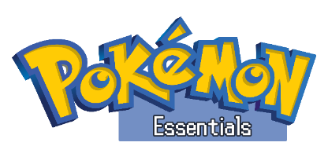

Pokémon Essentials is a Pokémon game project made in RPG Maker MV. Based on the [Pokémon Essentials](http://pokemonessentials.wikia.com/wiki/Pok%C3%A9mon_Essentials_Wiki)  project for RPG Maker XP and [Pokémon Showdown](https://github.com/Zarel/Pokemon-Showdown).

> ### This isn't that Pokémon essentials, this a different project, with the same goal to make a tool to create Pokémon fan games, but a totally different project, still WIP tho


## Getting Started
This project __don't use the RPG Maker MV editor__, a custom editor is under construction. But right now, to lauch and test the game you will need download and install some software. 

Follow the following steps to setup a development environment (A ready to use package will added later). 

1. Donwload and install [Node Js](https://nodejs.org/en/download/)

2. Use npm to donwload install [NW JS](https://nwjs.io/), open a command window and run the following command
    ```
    npm install -g nw --nwjs_build_type=sdk
    ```
3. Use npm to donwload and install [gulp]()
    ```
    npm i -g gulp-cli
    ```
4. Download code editor whit Typescript support. I recommend [VS Code](https://code.visualstudio.com/). [Atom](https://atom.io/) or [Sublime text](https://www.sublimetext.com/) they are also great options
but you will need download aditional plugin to wokrs with Typescript.

## Installing
Once you have setup the development environment follow the following steps to install the project on your machine:

1. Copy the repository to your machine using git clone or just download and unzip wherever you want.

    ```
    git clone https://github.com/pokemon-essentials/pokemon-essentials
    ```
2. Donwload aditional assets 

    Some graphics like the Pokémon Battlers sprites and icons are not include in this repository.
    You can download the missing assets from [here](https://drive.google.com/drive/folders/1oXbTrwAlL1SBVLykaHS1HlZf9c-IJWLo?usp=sharing) and just uncompress each one on the root folder.

3. Install Dev dependencies

    ```bash
    cd your-path-to-pokemon-essentials
    npm i
    ```

### Run and Build

There are some gulp task defined to build the project. All the **.ts** files in the ts directory will be traspiled into ES2015 javascript files in the dist folder and all the generated .js files will be injected into the project/index.html to run the game.

use ``` gulp dev-build ``` to build generate the .js files.

use ``` gulp watch ``` to build generate the .js files and watch for changes to rebuild.

#### Run
locate command line in the root directory of the project where is the package.json file and run ```nw .```

```bash
cd your-path-to-pokemon-essentials
nw .
```

## Discord Server

For any question or futher information, please contact me in the discord server https://discord.gg/eFPUx6m

## License

This project is licensed under the MIT License - see the [LICENSE](LICENSE) file for details
